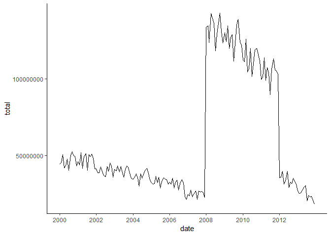
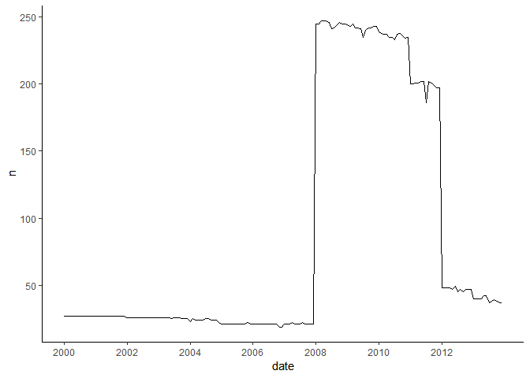
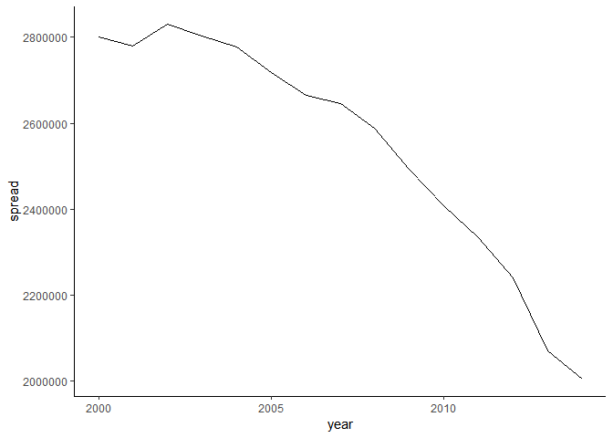
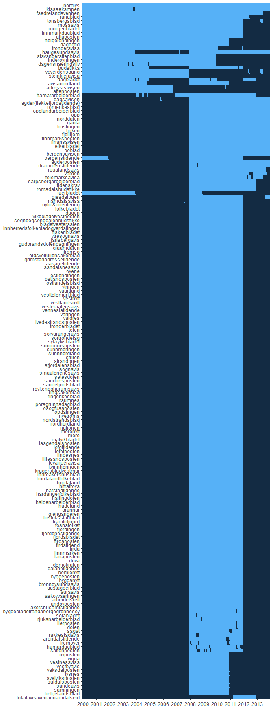

### Load packages


```r
library(httr) # GET, content
library(tidyverse)
library(stringdist)
library(reshape2)
library(jsonlite)
library(pxweb) #S tatistics Norway API
library(zoo) # Linear approximation
```


## Norwegian national library

### Wildcard search

Uncertainty words = "usikkerhet", "uvisse", "uvissa"


```r
rm(list = ls())

startYear <- 2000
endYear <- 2013
noYears <- endYear - startYear + 1

# factor: by how many positions wildcards are expanded 
# limit:  top #limit results,
# freq_lim: discard results with less than #freq_lim hits
unc_words <- c("usikkerhet*", "uvisse*", "uvissa*")
key_list <- c()

for (i in seq_along(unc_words)) {
querylist =
  list(
    word = unc_words[i],
    corpus = "avis",
    factor = "20",
    limit = "1000",
    freq_lim = "2"
  )
query_result = GET(url = "https://api.nb.no/ngram/wildcards", query = querylist)
key_list = c(key_list, names(content(query_result)))
}
```

### List of uncertainty words used in the model:
<button class="btn btn-primary" data-toggle="collapse" data-target="#BlockName"> Show/Hide </button>  
<div id="BlockName" class="collapse">

```
##   [1] "usikkerhet"                      "usikkerhet-"                    
##   [3] "usikkerhet!"                     "usikkerhet!»"                   
##   [5] "usikkerhet\""                    "usikkerhet\","                  
##   [7] "usikkerhet)"                     "usikkerhet),"                   
##   [9] "usikkerhet)."                    "usikkerhet,"                    
##  [11] "usikkerhet,\""                   "usikkerhet,»"                   
##  [13] "usikkerhet."                     "usikkerhet.\""                  
##  [15] "usikkerhet..."                   "usikkerhet.»"                   
##  [17] "usikkerhet:"                     "usikkerhet;"                    
##  [19] "usikkerhet?"                     "usikkerhet?»"                   
##  [21] "usikkerhet»"                     "usikkerhet»."                   
##  [23] "usikkerheta"                     "usikkerhetcn"                   
##  [25] "usikkerhetcr"                    "usikkerhete"                    
##  [27] "usikkerheten"                    "usikkerheten!"                  
##  [29] "usikkerheten)"                   "usikkerheten,"                  
##  [31] "usikkerheten."                   "usikkerheten.»"                 
##  [33] "usikkerheten:"                   "usikkerheten?"                  
##  [35] "usikkerheten»."                  "usikkerhetene"                  
##  [37] "usikkerhetene,"                  "usikkerhetene."                 
##  [39] "usikkerhetenes"                  "usikkerhetens"                  
##  [41] "usikkerheter"                    "usikkerheter,"                  
##  [43] "usikkerheter."                   "usikkerheter.»"                 
##  [45] "usikkerheterfor"                 "usikkerheteri"                  
##  [47] "usikkerhetfaktorene"             "usikkerhetfaktorer"             
##  [49] "usikkerhetfølelse"               "usikkerheti"                    
##  [51] "usikkerhetl"                     "usikkerhetmoment"               
##  [53] "usikkerhetmomentene"             "usikkerhetmomenter"             
##  [55] "usikkerhetn"                     "usikkerheto"                    
##  [57] "usikkerhetog"                    "usikkerhetom"                   
##  [59] "usikkerhetpå"                    "usikkerhets"                    
##  [61] "usikkerhets-"                    "usikkerhets-faktorene"          
##  [63] "usikkerhets-faktorer"            "usikkerhets-moment"             
##  [65] "usikkerhets-momentene"           "usikkerhets-momenter"           
##  [67] "usikkerhets-nivå"                "usikkerhets-preferanse-"        
##  [69] "usikkerhets-prinsipp"            "usikkerhets-relasjon"           
##  [71] "usikkerhets-relasjonen"          "usikkerhets-tilstand"           
##  [73] "usikkerhets-unnvikelse"          "usikkerhetsabsorbasjon"         
##  [75] "usikkerhetsabsorbering"          "usikkerhetsabsorbsjon"          
##  [77] "usikkerhetsabsorpsjon"           "usikkerhetsadverb"              
##  [79] "usikkerhetsaksen"                "usikkerhetsaksepterende"        
##  [81] "usikkerhetsakser"                "usikkerhetsanaiyser"            
##  [83] "usikkerhetsanal"                 "usikkerhetsanalvse"             
##  [85] "usikkerhetsanalvser"             "usikkerhetsanalysa"             
##  [87] "usikkerhetsanalyse"              "usikkerhetsanalyse,"            
##  [89] "usikkerhetsanalyse."             "usikkerhetsanalysen"            
##  [91] "usikkerhetsanalysen,"            "usikkerhetsanalysene"           
##  [93] "usikkerhetsanalyseprosessen"     "usikkerhetsanalyser"            
##  [95] "usikkerhetsanalyser,"            "usikkerhetsanalyser."           
##  [97] "usikkerhetsanalytiker"           "usikkerhetsandel"               
##  [99] "usikkerhetsangivelse"            "usikkerhetsangivelsene"         
## [101] "usikkerhetsangivelser"           "usikkerhetsangst"               
## [103] "usikkerhetsanslag"               "usikkerhetsanslagene"           
## [105] "usikkerhetsanslaget"             "usikkerhetsarbeidet"            
## [107] "usikkerhetsargumentet"           "usikkerhetsaspekt"              
## [109] "usikkerhetsaspektene"            "usikkerhetsaspekter"            
## [111] "usikkerhetsaspektet"             "usikkerhetsaversiv"             
## [113] "usikkerhetsaversive"             "usikkerhetsaversjon"            
## [115] "usikkerhetsaversjoner"           "usikkerhetsavsetmng"            
## [117] "usikkerhetsavsetning"            "usikkerhetsavsetningen"         
## [119] "usikkerhetsavsetningene"         "usikkerhetsavsetninger"         
## [121] "usikkerhetsavsløring"            "usikkerhetsbegrep"              
## [123] "usikkerhetsbegreper"             "usikkerhetsbegrepet"            
## [125] "usikkerhetsbehandling"           "usikkerhetsbehandlingen"        
## [127] "usikkerhetsbekymring"            "usikkerhetsbelte"               
## [129] "usikkerhetsbeltene"              "usikkerhetsbelter"              
## [131] "usikkerhetsbeltet"               "usikkerhetsbeltets"             
## [133] "usikkerhetsbeløp"                "usikkerhetsbeløpet"             
## [135] "usikkerhetsberedskap"            "usikkerhetsberedskapet"         
## [137] "usikkerhetsberedskapet."         "usikkerhetsberegning"           
## [139] "usikkerhetsberegningen"          "usikkerhetsberegningene"        
## [141] "usikkerhetsberegninger"          "usikkerhetsberegninger."        
## [143] "usikkerhetsbetingelser"          "usikkerhetsbetonte"             
## [145] "usikkerhetsbetraktning"          "usikkerhetsbetraktning."        
## [147] "usikkerhetsbetraktninger"        "usikkerhetsbidrag"              
## [149] "usikkerhetsbidragene"            "usikkerhetsbidraget"            
## [151] "usikkerhetsbidraget."            "usikkerhetsbilde"               
## [153] "usikkerhetsbildet"               "usikkerhetsbildet."             
## [155] "usikkerhetsbudsjett"             "usikkerhetsbudsjettet"          
## [157] "usikkerhetsbånd"                 "usikkerhetsbåndene"             
## [159] "usikkerhetsdelen"                "usikkerhetsdempende"            
## [161] "usikkerhetsdilemmaet"            "usikkerhetsdimensjon"           
## [163] "usikkerhetsdimensjonen"          "usikkerhetsdimensjonen."        
## [165] "usikkerhetsdimensjonene"         "usikkerhetsdimensjoner"         
## [167] "usikkerhetsdiskusjonen"          "usikkerhetsdreven"              
## [169] "usikkerhetsdrevet"               "usikkerhetseier"                
## [171] "usikkerhetseiere"                "usikkerhetseksponering"         
## [173] "usikkerhetseksponeringen"        "usikkerhetselement"             
## [175] "usikkerhetselementene"           "usikkerhetselementene."         
## [177] "usikkerhetselementer"            "usikkerhetselementer."          
## [179] "usikkerhetselementet"            "usikkerhetseliminering"         
## [181] "usikkerhetsellipsa"              "usikkerhetsellipse"             
## [183] "usikkerhetsellipsen"             "usikkerhetsellipsene"           
## [185] "usikkerhetsellipser"             "usikkerhetserklæring"           
## [187] "usikkerhetsestimat"              "usikkerhetsestimatene"          
## [189] "usikkerhetsestimater"            "usikkerhetsestimatet"           
## [191] "usikkerhetsestimering"           "usikkerhetsestimeringen"        
## [193] "usikkerhetsf"                    "usikkerhetsf??lelse"            
## [195] "usikkerhetsfakt"                 "usikkerhetsfakto-"              
## [197] "usikkerhetsfaktor"               "usikkerhetsfaktor,"             
## [199] "usikkerhetsfaktor."              "usikkerhetsfaktorar"            
## [201] "usikkerhetsfaktore"              "usikkerhetsfaktoren"            
## [203] "usikkerhetsfaktoren."            "usikkerhetsfaktorene"           
## [205] "usikkerhetsfaktorene,"           "usikkerhetsfaktorene."          
## [207] "usikkerhetsfaktorenes"           "usikkerhetsfaktorer"            
## [209] "usikkerhetsfaktorer,"            "usikkerhetsfaktorer."           
## [211] "usikkerhetsfase"                 "usikkerhetsfasen"               
## [213] "usikkerhetsfasens"               "usikkerhetsfeil"                
## [215] "usikkerhetsfeilen"               "usikkerhetsfeilen."             
## [217] "usikkerhetsfellene"              "usikkerhetsfellesskap"          
## [219] "usikkerhetsfelt"                 "usikkerhetsfeltet"              
## [221] "usikkerhetsfenomen"              "usikkerhetsfenomener"           
## [223] "usikkerhetsfenomenet"            "usikkerhetsfigurer"             
## [225] "usikkerhetsfjerningen"           "usikkerhetsfolelse"             
## [227] "usikkerhetsfolelsen"             "usikkerhetsfordeling"           
## [229] "usikkerhetsfordelingen"          "usikkerhetsfordelinger"         
## [231] "usikkerhetsforhold"              "usikkerhetsforholdene"          
## [233] "usikkerhetsforholdene,"          "usikkerhetsforholdet"           
## [235] "usikkerhetsformelen"             "usikkerhetsfornemmelse"         
## [237] "usikkerhetsfornemmelse,"         "usikkerhetsfornemmelsen"        
## [239] "usikkerhetsfornemmelser"         "usikkerhetsfornemmelser."       
## [241] "usikkerhetsforplantningen"       "usikkerhetsfremmende"           
## [243] "usikkerhetsfunksjon"             "usikkerhetsfunksjonen"          
## [245] "usikkerhetsfølelse"              "usikkerhetsfølelse,"            
## [247] "usikkerhetsfølelse."             "usikkerhetsfølelsen"            
## [249] "usikkerhetsfølelsen,"            "usikkerhetsfølelsen."           
## [251] "usikkerhetsfølelsene"            "usikkerhetsfølelser"            
## [253] "usikkerhetsfølelser,"            "usikkerhetsfølelser."           
## [255] "usikkerhetsgevinster"            "usikkerhetsgrad"                
## [257] "usikkerhetsgraden"               "usikkerhetsgrense"              
## [259] "usikkerhetsgrensen"              "usikkerhetsgrensene"            
## [261] "usikkerhetsgrensene."            "usikkerhetsgrenser"             
## [263] "usikkerhetsgrenser."             "usikkerhetsgruppe"              
## [265] "usikkerhetshendelse"             "usikkerhetshendelsen"           
## [267] "usikkerhetshendelsene"           "usikkerhetshendelser"           
## [269] "usikkerhetshypotesen"            "usikkerhetshåndtering"          
## [271] "usikkerhetshåndtering."          "usikkerhetshåndteringen"        
## [273] "usikkerhetshåndteringen?"        "usikkerhetsiedelse"             
## [275] "usikkerhetsindeks"               "usikkerhetsindeksen"            
## [277] "usikkerhetsinformasjon"          "usikkerhetsintervall"           
## [279] "usikkerhetsintervall."           "usikkerhetsintervallene"        
## [281] "usikkerhetsintervaller"          "usikkerhetsintervaller."        
## [283] "usikkerhetsintervallet"          "usikkerhetsintervallet."        
## [285] "usikkerhetsjustering"            "usikkerhetsjusteringer"         
## [287] "usikkerhetskapitlet"             "usikkerhetskarakteren"          
## [289] "usikkerhetskart"                 "usikkerhetskategori"            
## [291] "usikkerhetskategorien"           "usikkerhetskategoriene"         
## [293] "usikkerhetskategorier"           "usikkerhetskilde"               
## [295] "usikkerhetskilden"               "usikkerhetskildene"             
## [297] "usikkerhetskilder"               "usikkerhetskilder."             
## [299] "usikkerhetskjensle"              "usikkerhetsklausulen"           
## [301] "usikkerhetsklima"                "usikkerhetskoeffisienten"       
## [303] "usikkerhetskompensasjon"         "usikkerhetskompleks"            
## [305] "usikkerhetskomplekset"           "usikkerhetskomponent"           
## [307] "usikkerhetskomponenten"          "usikkerhetskomponentene"        
## [309] "usikkerhetskomponentene,"        "usikkerhetskomponenter"         
## [311] "usikkerhetskomponenter."         "usikkerhetskonsekvenser"        
## [313] "usikkerhetskontroll"             "usikkerhetskoordinatene"        
## [315] "usikkerhetskorrigert"            "usikkerhetskostnad"             
## [317] "usikkerhetskostnad."             "usikkerhetskostnaden"           
## [319] "usikkerhetskostnadene"           "usikkerhetskostnader"           
## [321] "usikkerhetskrav"                 "usikkerhetskriterier"           
## [323] "usikkerhetskultur"               "usikkerhetskurs"                
## [325] "usikkerhetskurven"               "usikkerhetsledd"                
## [327] "usikkerhetsleddet"               "usikkerhetsledelse"             
## [329] "usikkerhetsledelse."             "usikkerhetsledelsesaktivitetene"
## [331] "usikkerhetsledelsesprosessene"   "usikkerhetsledelsesprosesser"   
## [333] "usikkerhetsliste"                "usikkerhetslisten"              
## [335] "usikkerhetslogikk"               "usikkerhetslommene"             
## [337] "usikkerhetslommer"               "usikkerhetslov"                 
## [339] "usikkerhetsm"                    "usikkerhetsmargin"              
## [341] "usikkerhetsmargin,"              "usikkerhetsmargin."             
## [343] "usikkerhetsmarginal"             "usikkerhetsmarginen"            
## [345] "usikkerhetsmarginene"            "usikkerhetsmarginer"            
## [347] "usikkerhetsmarginer,"            "usikkerhetsmarginer."           
## [349] "usikkerhetsmarkøren"             "usikkerhetsmarkører"            
## [351] "usikkerhetsmatrise"              "usikkerhetsmatrisen"            
## [353] "usikkerhetsmessig"               "usikkerhetsmessige"             
## [355] "usikkerhetsminimalisering"       "usikkerhetsmo"                  
## [357] "usikkerhetsmo-"                  "usikkerhetsmodell"              
## [359] "usikkerhetsmodellen"             "usikkerhetsmodeller"            
## [361] "usikkerhetsmodellering"          "usikkerhetsmodul"               
## [363] "usikkerhetsmom"                  "usikkerhetsmomcnter"            
## [365] "usikkerhetsmomen"                "usikkerhetsmomen-"              
## [367] "usikkerhetsmoment"               "usikkerhetsmoment)."            
## [369] "usikkerhetsmoment,"              "usikkerhetsmoment."             
## [371] "usikkerhetsmoment:"              "usikkerhetsmoment;"             
## [373] "usikkerhetsmomenta"              "usikkerhetsmomentene"           
## [375] "usikkerhetsmomentene,"           "usikkerhetsmomentene."          
## [377] "usikkerhetsmomentenes"           "usikkerhetsmomenter"            
## [379] "usikkerhetsmomenter,"            "usikkerhetsmomenter."           
## [381] "usikkerhetsmomenter.»"           "usikkerhetsmomenter:"           
## [383] "usikkerhetsmomentet"             "usikkerhetsmomentet,"           
## [385] "usikkerhetsmomentet."            "usikkerhetsmomentet.»"          
## [387] "usikkerhetsmoraent"              "usikkerhetsmoraenter"           
## [389] "usikkerhetsmornent"              "usikkerhetsmornenter"           
## [391] "usikkerhetsmotivert"             "usikkerhetsmål"                 
## [393] "usikkerhetsmålene"               "usikkerhetsmålet"               
## [395] "usikkerhetsnivå"                 "usikkerhetsnivåene"             
## [397] "usikkerhetsnivåer"               "usikkerhetsnivået"              
## [399] "usikkerhetsog"                   "usikkerhetsomr"                 
## [401] "usikkerhetsomr??de"              "usikkerhetsomrade"              
## [403] "usikkerhetsområde"               "usikkerhetsområdene"            
## [405] "usikkerhetsområder"              "usikkerhetsområdet"             
## [407] "usikkerhetsopphopning"           "usikkerhetsopplevelse"          
## [409] "usikkerhetsopplevelser"          "usikkerhetsoppløsning"          
## [411] "usikkerhetsoppløsningen"         "usikkerhetsord"                 
## [413] "usikkerhetsorienterte"           "usikkerhetsoverslag"            
## [415] "usikkerhetsoverslaget"           "usikkerhetsparametre"           
## [417] "usikkerhetsperiode"              "usikkerhetsperioden"            
## [419] "usikkerhetsperioder"             "usikkerhetsperspektiv"          
## [421] "usikkerhetsperspektivet"         "usikkerhetspnnsipp"             
## [423] "usikkerhetspnnsippet"            "usikkerhetspolitikk"            
## [425] "usikkerhetspolitikk,"            "usikkerhetspolitikk."           
## [427] "usikkerhetspolitikk»."           "usikkerhetspolitikken"          
## [429] "usikkerhetspost"                 "usikkerhetsposten"              
## [431] "usikkerhetsposter"               "usikkerhetspreget"              
## [433] "usikkerhetsprinsipp"             "usikkerhetsprinsipp,"           
## [435] "usikkerhetsprinsipp."            "usikkerhetsprinsipper"          
## [437] "usikkerhetsprinsippet"           "usikkerhetsprinsippet,"         
## [439] "usikkerhetsprinsippet."          "usikkerhetsprinsippets"         
## [441] "usikkerhetsproblem"              "usikkerhetsproblematikken"      
## [443] "usikkerhetsproblemene"           "usikkerhetsproblemer"           
## [445] "usikkerhetsproblemet"            "usikkerhetsprodukt"             
## [447] "usikkerhetsprofil"               "usikkerhetsprofilen"            
## [449] "usikkerhetsprofilene"            "usikkerhetsprofll"              
## [451] "usikkerhetsprosent"              "usikkerhetsprosenten"           
## [453] "usikkerhetsprosentene"           "usikkerhetsprosenter"           
## [455] "usikkerhetsprovoserende"         "usikkerhetspunkt"               
## [457] "usikkerhetspunktene"             "usikkerhetspunkter"             
## [459] "usikkerhetspunktet"              "usikkerhetspåslag"              
## [461] "usikkerhetspåslaget"             "usikkerhetspåvirkningen"        
## [463] "usikkerhetsrammer"               "usikkerhetsraomenter"           
## [465] "usikkerhetsrapport"              "usikkerhetsrapporten"           
## [467] "usikkerhetsrapporter"            "usikkerhetsreaksjon"            
## [469] "usikkerhetsreaksjoner"           "usikkerhetsreduksjon"           
## [471] "usikkerhetsreduksjon."           "usikkerhetsreduksjonen"         
## [473] "usikkerhetsreduksjonsteori"      "usikkerhetsreduksjonsteorien"   
## [475] "usikkerhetsreduserende"          "usikkerhetsregime"              
## [477] "usikkerhetsregister"             "usikkerhetsregler"              
## [479] "usikkerhetsregning"              "usikkerhetsregning."            
## [481] "usikkerhetsregningen"            "usikkerhetsregnskapet"          
## [483] "usikkerhetsrela-"                "usikkerhetsrelas"               
## [485] "usikkerhetsrelasj"               "usikkerhetsrelasjon"            
## [487] "usikkerhetsrelasjon)."           "usikkerhetsrelasjon,"           
## [489] "usikkerhetsrelasjon."            "usikkerhetsrelasjon:"           
## [491] "usikkerhetsrelasjonen"           "usikkerhetsrelasjonen,"         
## [493] "usikkerhetsrelasjonen."          "usikkerhetsrelasjonene"         
## [495] "usikkerhetsrelasjonenes"         "usikkerhetsrelasjoner"          
## [497] "usikkerhetsrelasjoner,"          "usikkerhetsrelasjoner."         
## [499] "usikkerhetsrelatert"             "usikkerhetsreserve"             
## [501] "usikkerhetsreserven"             "usikkerhetsreserver"            
## [503] "usikkerhetsrnoment"              "usikkerhetsrnomenter"           
## [505] "usikkerhetsrom"                  "usikkerhetsrommet"              
## [507] "usikkerhetsrådgiver"             "usikkerhetssamfunn"             
## [509] "usikkerhetssamfunnet"            "usikkerhetssamfunnets"          
## [511] "usikkerhetssammenheng"           "usikkerhetssignaler"            
## [513] "usikkerhetssirkel"               "usikkerhetssirkelen"            
## [515] "usikkerhetssirklene"             "usikkerhetssirkler"             
## [517] "usikkerhetssituasjon"            "usikkerhetssituasjonen"         
## [519] "usikkerhetssituasjonene"         "usikkerhetssituasjoner"         
## [521] "usikkerhetssituasjoner."         "usikkerhetsskala"               
## [523] "usikkerhetsskalaen"              "usikkerhetsskapende"            
## [525] "usikkerhetssona"                 "usikkerhetssone"                
## [527] "usikkerhetssonen"                "usikkerhetssonen)"              
## [529] "usikkerhetssonen."               "usikkerhetssoner"               
## [531] "usikkerhetsspenn"                "usikkerhetsspennet"             
## [533] "usikkerhetsspiralen"             "usikkerhetsstadiet"             
## [535] "usikkerhetsstemning"             "usikkerhetsstruktur"            
## [537] "usikkerhetsstrukturen"           "usikkerhetsstynng"              
## [539] "usikkerhetsstyring"              "usikkerhetsstyring."            
## [541] "usikkerhetsstyringen"            "usikkerhetsstyringsprosess"     
## [543] "usikkerhetsstyringsprosessen"    "usikkerhetsstyringsprosessene"  
## [545] "usikkerhetsstyringsprosesser"    "usikkerhetsstørrelser"          
## [547] "usikkerhetssymptomer"            "usikkerhetssynspunkt"           
## [549] "usikkerhetstall"                 "usikkerhetstallene"             
## [551] "usikkerhetsteamleder"            "usikkerhetstegn"                
## [553] "usikkerhetstemaet"               "usikkerhetstendens"             
## [555] "usikkerhetstenkning"             "usikkerhetsteorem"              
## [557] "usikkerhetsteori"                "usikkerhetsteorien"             
## [559] "usikkerhetstest"                 "usikkerhetstilfelle"            
## [561] "usikkerhetstilfellet"            "usikkerhetstillegg"             
## [563] "usikkerhetstillegget"            "usikkerhetstilstand"            
## [565] "usikkerhetstilstanden"           "usikkerhetstoleranse"           
## [567] "usikkerhetstrekk"                "usikkerhetstypene"              
## [569] "usikkerhetstyper"                "usikkerhetsunngåelse"           
## [571] "usikkerhetsunnvikelse"           "usikkerhetsunnvikelse)."        
## [573] "usikkerhetsunnvikelse,"          "usikkerhetsunnvikelse."         
## [575] "usikkerhetsunnvikelsen"          "usikkerhetsunnvikelsesindeks"   
## [577] "usikkerhetsunnvikende"           "usikkerhetsvakuum"              
## [579] "usikkerhetsvariabelen"           "usikkerhetsvariabler"           
## [581] "usikkerhetsvegring"              "usikkerhetsverdi"               
## [583] "usikkerhetsverdiene"             "usikkerhetsverdier"             
## [585] "usikkerhetsvillig"               "usikkerhetsvirkningen"          
## [587] "usikkerhetsvurderin"             "usikkerhetsvurdering"           
## [589] "usikkerhetsvurderinga"           "usikkerhetsvurderingen"         
## [591] "usikkerhetsvurderingene"         "usikkerhetsvurderinger"         
## [593] "usikkerhetsvurderinger."         "usikkerhetsårsakene"            
## [595] "usikkerhetsårsaker"              "usikkerhettil"                  
## [597] "usikkerhetøn"                    "uvissa"                         
## [599] "uvissa,"                         "uvissa."                        
## [601] "uvissaa"                         "uvissar"                        
## [603] "uvissare"                        "uvissari"                       
## [605] "uvissas"                         "uvisse"                         
## [607] "uvisse-"                         "uvisse-dansen"                  
## [609] "uvisse,"                         "uvisse."                        
## [611] "uvisse;"                         "uvissefaktorar"                 
## [613] "uvissegraden"                    "uvissegrenser"                  
## [615] "uvisseleg"                       "uvisselig"                      
## [617] "uvisselige"                      "uvissemoment"                   
## [619] "uvissemomenta"                   "uvissen"                        
## [621] "uvissene"                        "uvisseprinsipp"                 
## [623] "uvisseprinsippet"                "uvisser"                        
## [625] "uvissere"                        "uvisserekning"                  
## [627] "uvisserelasj"                    "uvisserelasjon"                 
## [629] "uvisserelasjonane"               "uvisserelasjonar"               
## [631] "uvisserelasjonen"                "uvisses"                        
## [633] "uvisseste"                       "uvisset"                        
## [635] "uvissetilfella"                  "uvisseutrekningar"
```
</div>

### Wordcounts
Counts the number of uncertainty words and total words, per month, per newspaper.


```r
key_list <- c(key_list, tools::toTitleCase(key_list))
names(key_list) <- rep("word", length(key_list))
key_list <- lapply(key_list, function(x) URLencode(x, reserved=T))
key_list <- list(total = list(total = "yes"),
                uncertainty = key_list)

# Get list of newspapers
url_nb <- "https://api.nb.no/ngram/ngram"
querylist   <- list(corpus = "avisnavn", word = "%")
papers_list <- GET(url = url_nb, query = querylist)
papers_list <- unlist(content(papers_list))

for (mth in 1:12) {

    for (paper in papers_list) {
    print(paste0(paper, " (Month: ", mth, ")"))
      
    main <- data.frame(year  = 2000:2018,
                      paper = paper,
                      month = mth)
    main[, names(key_list)] = 0

    for (k in 1:length(key_list)) {

      for (i in 1:length(key_list[[k]])) {

        querylist <-
          c(
            key_list[[k]][i],
            list(
              paper_name = paper,
              month = mth,
              corpus = "avis",
              yearfrom = "2000",
              yearto = "2018"
            )
          )
        
        out <- GET(url = url_nb, query = querylist)
        out <- unlist(content(out))

        if (is.null(out))
          next()

        newdata <- as.data.frame(t(matrix(out, nrow = 2)))
        newdata <- aggregate(newdata$V2, list(newdata$V1), FUN = sum)
        r <- newdata$Group.1 - (2000 - 1)
        c <- names(key_list[k])
        main[r, c] <- main[r, c] + newdata$x

      } # keys
    } # key_list
    dataset <- bind_rows(main, if (exists("dataset")) dataset)
    
  } # mth_list, papers_list

}

saveRDS(dataset, "Data/monthlyData.rds")
```

### Data cleaning

```r
database <- readRDS("Data/monthlyData.rds")
database$paper <- as.character(database$paper)
names(database)[6] <- "uncertainty"

database$paper <- as.character(database$paper)

database <- database %>% filter(!total == 0)

uniquePapers <- length(unique(database$paper))

# Remove non-Norwegian papers:
database <- database %>% filter(!paper %in% c("avvir", "upstream", "tradewinds", "recharge", "assu", "minaigi", "ruijankaiku"))

uniquePapers <- c(uniquePapers, length(unique(database$paper)))

# Combines newspapers series that contains the same paper under different names:
toReplace <- c("dagsavisen", "dagsavisen", "dagsavisen", "bergensavisen", "gudbrandsdoelendagning", "gudbrandsdoelendagning", "gudbrandsdoelendagning", "gudbrandsdoelendagning",
               "tronderavisa", "dagensnaeringsliv", "smaalenenesavis", "nytid", "samholdvelgeren", "helgelandarbeiderblad", "telemarksavisa", "budstikkaforaskerogb", "dagenmagazinet",
               "drammenstidende", "drammenstidende", "fiskeribladetfiskare", "tromsfolkeblad", "friheten", "gjengangeren", "hardangerfolkeblad", "lofotposten", 
               "telemarksavisa", "eidsvollullensakerbl", "hardangerfolkeblad", "avisanordland", "avisanordland", "fiskeribladetfiskare")

toBeReplaced <- c("arbeiderbladetoslo", "arbeiderbladet", "dagsavisenarbeiderbladet", "bergensarbeiderblad", "gudbrandsdolen", "dagningen", "gudbrandsdoelen", "gudbrandsdolendagnin",
                  "nordtrondelaginntrondelagen", "norgeshandelsogsjoefartstidende", "oevresmaalenene", "orientering", "samholdgjoevik", "helgelandarbeiderbla", "telemarkarbeiderblad", "askerogbaerumsbudstikke", "dagenbergen",
                  "drammenstidendeogbuskerudblad", "drammenstidendeogbus", "fiskeribladet", "tffolkebladet", "friheten2", "gjengangeren2", "hardangerfolkeblad", "lofotposten2", 
                  "telemarkarbeiderblad", "eidsvoldblad", "hardanger", "nordlandsframtid", "nordlandsposten", "fiskaren")

replacement <- data.frame(toReplace, toBeReplaced)

for (i in seq_along(toBeReplaced)) {
database[database$paper == toBeReplaced[i], 3] <- toReplace[i]
}

uniquePapers <- c(uniquePapers, length(unique(database$paper)))

# Remove papers with only one observation
oneObs <- database %>% group_by(paper) %>% count() %>% filter(n == 1)
database <- database %>% filter(!paper %in% oneObs$paper)

uniquePapers <- c(uniquePapers, length(unique(database$paper)))
```
There are only six newspapers in the database after 2013, so we only use data up until that year.

```r
database %>% filter(year > 2013) %>% distinct(paper)
```

```
##            paper
## 1         varden
## 2  romerikesblad
## 3       romerike
## 4   finansavisen
## 5     dagsavisen
## 6 telemarksavisa
```

```r
database <- database %>% filter(year <= 2013)
```
How has the number of unique newspapers in the database been reduced?

```r
data.frame(operation = c("Original data", "Removed non-Norwegian", "Combined series", "Removed one obs."), uniquePapers)
```

```
##               operation uniquePapers
## 1         Original data          326
## 2 Removed non-Norwegian          319
## 3       Combined series          292
## 4      Removed one obs.          291
```


## Norwegian Media Businesses' Association
The data is downloaded from http://www.aviskatalogen.no/jsf/report/index.jsf

### Data cleaning

```r
coverage <- read.csv("Data/SpredningOgHusstandsdekningKommune_1558367839680.csv",
                    row.names = NULL, sep = ";", encoding = "ISO 8859-1", 
                    stringsAsFactors = F)

coverage <- coverage[, -(8:9)]

names(coverage) <- c("paper", "municipality", "municipality.no.", "households", "dekning", "spread", "year")

coverage$paper <- tolower(coverage$paper)

#
subt <- data.frame(original = c("æ", "ø", "å", "Æ", "Ø", "Å"), repl = c("ae", "o", "aa", "AE", "O", "AA"))

for (i in 1:3) {
  coverage$paper <- gsub(subt[i, 1], subt[i, 2], coverage$paper)
}

for (i in 1:6) {
  coverage$municipality <- gsub(subt[i, 1], subt[i, 2], coverage$municipality)
}

# Replaces comma with punctuation mark
coverage$dekning <- gsub(",", ".", coverage$dekning, fixed = T)

# Removes percentage sign
coverage$dekning <- gsub("%", "", coverage$dekning, fixed = T)

# Removes blank spaces
coverage$spread <- gsub(" ", "", coverage$spread, fixed = T)
coverage$households <- gsub(" ", "", coverage$households, fixed = T)

# Converts to numeric
coverage[, 4] <- as.numeric(coverage[, 4])
coverage[, 5] <- as.numeric(coverage[, 5])
coverage[, 6] <- as.numeric(coverage[, 6])

# Subset coverage year
coverage[, 7] <- substr(coverage[, 7], 1, 4)

coverage$year <- as.numeric(coverage$year)

# Filter year less or equal to 2014:
coverage <- coverage %>% filter(year <= 2014)

# Add "0" to beginning of munucipality numbers with only 3 digits
coverage <- coverage %>% mutate(municipality.no. = ifelse(nchar(municipality.no.) == 3, paste0("0", municipality.no.), municipality.no.))

# Remove " " and "-" from paper names
unwantedChr <- c(" ", "-")

for (i in seq_along(unwantedChr)) {
coverage$paper <- gsub(unwantedChr[i], "", coverage$paper)
}
```

## Exploratory analysis

### Library data

Which paper/month has the most uncertainty words?

```r
database %>% arrange(desc(uncertainty)) %>% head(n = 5)
```

```
##        X year       paper month   total uncertainty
## 1  82300 2001 aftenposten    10 8313413         353
## 2 109900 2001 aftenposten     9 8486423         316
## 3  54699 2000 aftenposten    11 9091350         303
## 4  82299 2000 aftenposten    10 9573026         299
## 5 109897 1998 aftenposten     9 8959129         294
```
Not suprisingly the time after 9/11 is at the top

Which paper/month has the most uncertainty words per words?

```r
database %>%
  mutate(uncertaintyPerWord = uncertainty / total) %>%
  arrange(desc(uncertaintyPerWord)) %>%
  head(n = 5)
```

```
##        X year          paper month total uncertainty uncertaintyPerWord
## 1  97768 2013   klaebuposten     9 52647          18       0.0003418998
## 2  97697 2011       klartale     9 39038          10       0.0002561607
## 3  14967 2012   klaebuposten    12 36184           9       0.0002487287
## 4 205887 2009 meraakerposten     5 35226           8       0.0002271050
## 5 130681 2013      fjellljom     8 96254          21       0.0002181728
```

How many paper/months have no uncertainty words?

```r
database %>% filter(uncertainty == 0) %>% nrow()
```

```
## [1] 3151
```


```r
database <- database %>% filter(year >= startYear, year <= endYear)

dateDf <- data.frame(seq(from = as.Date("2000/1/1"), to = as.Date("2013/12/31"), by = "month"), 
                   rep(seq(from = startYear, to = endYear), each = 12), 
                   rep(seq(from = 1, to = 12), noYears))

names(dateDf) <- c("date", "year", "month")

database <- inner_join(database, dateDf)
```

```
## Joining, by = c("year", "month")
```


```r
# Total words
database %>% group_by(date) %>% summarise(total = sum(total)) %>%
  ggplot(aes(date, total)) +
  geom_line() +
  scale_x_date(breaks = as.Date(c("2000-01-01", "2002-01-01", "2004-01-01", "2006-01-01", "2008-01-01", "2010-01-01", "2012-01-01")), date_labels = "%Y") +
  theme_classic()
```

<!-- -->

```r
# Unique newspapers
database %>% filter(!total == 0) %>% group_by(date) %>% distinct(paper) %>% count() %>%
  ggplot(aes(date, n)) +
  geom_line() +
  scale_x_date(breaks = as.Date(c("2000-01-01", "2002-01-01", "2004-01-01", "2006-01-01", "2008-01-01", "2010-01-01", "2012-01-01")), date_labels = "%Y") +
  theme_classic()
```

<!-- -->


### Circulation data

Total circulation per year:

```r
coverage %>% group_by(year) %>% summarise(spread = sum(spread)) %>%
ggplot(aes(year, spread)) +
  geom_line() +
  theme_classic()
```

<!-- -->


```r
coverage %>% group_by(year) %>% distinct(paper) %>% count() %>%
ggplot(aes(year, n)) +
  geom_line() +
  theme_classic()
```

<!-- -->

## Match newspaper names using string distance
A bit messy, but it seems like the best way. Some have to be manually matched at the end.


```r
# Match papers that have the exact same name.
papersCoverage <- data.frame(paper = tolower(unique(coverage$paper)), stringsAsFactors = FALSE)
                             
papersDatabase <- data.frame(paper = unique(database$paper), stringsAsFactors = FALSE)

matchedPapers <- inner_join(papersCoverage, papersDatabase)
```

```
## Joining, by = "paper"
```

```r
matchedPapers <- data.frame(s1name = matchedPapers$paper, s2name = matchedPapers$paper, stringsAsFactors = FALSE)

papersCoverage <- papersCoverage %>% filter(!paper %in% matchedPapers$s1name)
papersDatabase <- papersDatabase %>% filter(!paper %in% matchedPapers$s1name)

# Match using a variety of string distance measurements
emptyVector1 <- c(rep(0, length(papersDatabase$paper)))
paperNames <- data.frame(papersDatabase$paper, emptyVector1, stringsAsFactors = F)
names(paperNames) <- "name"

emptyVector2 <- c(rep(0, length(papersCoverage$paper)))
namesDekning <- data.frame(papersCoverage$paper, emptyVector2, stringsAsFactors = F)
names(namesDekning)[1] <- "name"

#distance.methods<-'jw'
distance.methods<-c('osa','lv','dl','lcs','qgram','cosine','jaccard','jw')
dist.methods<-list()
for (m in 1:length(distance.methods)) {
  dist.name.enh<-matrix(NA, ncol = length(paperNames$name), nrow = length(namesDekning$name))
  for (i in 1:length(paperNames$name)) {
    for (j in 1:length(namesDekning$name)) { 
      dist.name.enh[j, i] <- stringdist(tolower(paperNames[i, ]$name), 
                                        tolower(namesDekning[j, ]$name), method = distance.methods[m])      
      #adist.enhance(paperNames[i,]$name,namesDekning[j,]$name)
    }  
  }
  dist.methods[[distance.methods[m]]] <- dist.name.enh
}

match.s1.s2.enh <- NULL
for (m in 1:length(dist.methods)) {
  dist.matrix <- as.matrix(dist.methods[[distance.methods[m]]])
  min.name.enh <- apply(dist.matrix, 1, base::min)
  for (i in 1:nrow(dist.matrix)) {
    s2.i <- match(min.name.enh[i], dist.matrix[i, ])
    s1.i <- i
    match.s1.s2.enh <- rbind(data.frame(s2.i = s2.i, s1.i = s1.i, s2name = paperNames[s2.i, ]$name,
                                        s1name = namesDekning[s1.i, ]$name, adist = min.name.enh[i],
                                        method = distance.methods[m], stringsAsFactors = FALSE), match.s1.s2.enh)
  }
}

# Results from stringdist matching
matched.names.matrix <- dcast(match.s1.s2.enh, s2.i + s1.i + s2name + s1name ~ method, value.var = "adist")
matched.names.matrix <- matched.names.matrix %>% arrange(jw)

# Extract matches based on limiting values set for each string distance measure
matched2 <- matched.names.matrix %>% 
  filter(jw <= 0.13 |
           jaccard <= 0.08 |
           cosine <= 0.072 |
           lcs <= 3 |
           dl <= 2 |
           lv <= 2 |
           osa <= 2) %>%
  select(s2name, s1name)

matchedPapers <- rbind(matchedPapers, matched2)

matched.names.matrix <- matched.names.matrix %>%
  filter(!s2name %in% matched2$s2name | !s1name %in% matched.names.matrix$s1name)

# Manually pick out the last matching papers.
matchedPapers <- rbind(matchedPapers, matched.names.matrix[c(1, 3, 5, 8, 11, 13, 76), c(3, 4)])
```


```r
coverage <- matchedPapers %>% rename(paper = s1name) %>% left_join(coverage) %>% select(-s2name)
```

```
## Joining, by = "paper"
```

```r
database <- matchedPapers %>% rename(paper = s2name) %>% left_join(database) %>% select(-paper) %>% rename(paper = s1name)
```

```
## Joining, by = "paper"
```

### Add counties

```r
counties <- data.frame(county = c("Akershus", "Aust-Agder", "Buskerud", "Finnmark - Finnm?rku", "Hedmark", "Hordaland", "M?re og Romsdal", "Nordland", "Oppland",  "Oslo", "Rogaland", "Sogn og Fjordane", "Telemark", "Troms - Romsa", "Tr?ndelag", "Vest-Agder", "Vestfold", "?stfold", "Tr?ndelag", "Tr?ndelag"), from = c(0200, 0900, 0600, 2000, 0400, 1200, 1500, 1800, 0500, 0300, 1100, 1400, 0800, 1900, 5000, 1000, 700, 0100, 01600, 01700), stringsAsFactors = F)

coverage$municipality.no. <- as.numeric(coverage$municipality.no.)

coverageNumbers <- coverage %>% distinct(municipality.no.)

z <- character(nrow(coverageNumbers))

for (j in 1:nrow(coverageNumbers)){
   for (i in 1:nrow(counties)){
    if((coverageNumbers[j, 1] > counties[i, 2]) & (coverageNumbers[j, 1] < counties[i, 2] + 99)) {
    z[j] <- counties[i, 1]
    }
  }
}

coverageNumbers$county <- z

coverage <- inner_join(coverage, coverageNumbers, by = "municipality.no.")
```

### Tile graph

```r
possiblePapers <- tibble(paper = rep(rep(unique(database$paper)), each = 12*(noYears)), 
                         date = rep(seq(from = as.Date("2000/1/1"), to = as.Date("2013/12/31"), by = "month"), length(unique(database$paper))))


papersPerMonth <- database %>%
  group_by(date, paper) %>% 
  summarise(count = n()) %>% 
  mutate(data = 1)
  
tileData <- right_join(papersPerMonth, possiblePapers)
```

```
## Joining, by = c("date", "paper")
```

```r
tileData[is.na(tileData)] <- 0

tileData <- inner_join(tileData, papersPerMonth %>% group_by(paper) %>% summarise(noOfMonths = sum(data)) %>% ungroup())
```

```
## Joining, by = "paper"
```

```r
tileData <- tileData %>% arrange(noOfMonths)

tileData$paper <- factor(tileData$paper, levels = (unique(tileData$paper)))

graphData <- tileData %>% #filter(year %in% 2000:2007) %>%
  ggplot(aes(date, paper)) +
  scale_y_discrete(expand=c(0,0)) +
  scale_x_date(expand = c(0,0), date_breaks = "1 year", date_labels = "%Y") +
  geom_tile(aes(fill = data, color = data), size = 1, show.legend = FALSE) +
  theme(axis.title.x=element_blank(),
        axis.title.y=element_blank())
```


```r
graphData
```




### Split the dataset:


```r
dataMonths2000 <- database %>%
  filter(year %in% 2000:2007) %>%
  distinct(paper, date) %>%
  group_by(paper) %>%
  count(name = "freq") %>%
  arrange(desc(freq)) %>%
  ungroup() %>%
  filter(freq * 100 / max(freq) > 80) # Select papers with < 20% missing data

dataMonths2008 <- database %>%
  filter(year %in% 2008:2011) %>%
  distinct(paper, date) %>%
  group_by(paper) %>%
  count(name = "freq") %>%
  arrange(desc(freq)) %>%
  ungroup() %>%
  filter(freq * 100 / max(freq) > 80) # Select papers with < 20% missing data

database <- rbind(database %>% filter(paper %in% unique(dataMonths2000$paper), year %in% 2000:2007), 
                  database %>% filter(paper %in% unique(dataMonths2008$paper), year %in% 2008:2011))

database$index <- c(rep(2000, nrow(database[database$year %in% 2000:2007, ])), 
                    rep(2008, nrow(database[database$year %in% 2008:2011, ])))
  
#coverage2000 <- coverage %>% filter(paper %in% unique(dataMonths2000$paper), year %in% 2000:2007)
```

### Explanatory analysis 2000-2007


### Explanatory analysis 2008-2011


### Economic variables


```r
# Brent crude spot price from the U.S. Energy Information Administration API
oilPrice <- GET("http://api.eia.gov/series/?api_key=0d61de68602f55c38b02f207c5896434&series_id=PET.RBRTE.D")
oilPrice <- fromJSON((rawToChar(oilPrice$content)))
oilPrice <- as_tibble(oilPrice$series$data[[1]])
```

```
## Warning: `as_tibble.matrix()` requires a matrix with column names or a `.name_repair` argument. Using compatibility `.name_repair`.
## This warning is displayed once per session.
```

```r
names(oilPrice) <- c("date", "oilPrice")
oilPrice$date <- as.Date(oilPrice$date, format = "%Y%m%d")
oilPrice$oilPrice <- as.numeric(oilPrice$oilPrice)

# Norwegian local unemployment from Statistics Norway API
queryUnemployment <- 
  pxweb_query(list(
    "Region" = c("*"), # Use "*" to select all
    "Kjonn" = c("0"), # 0 = both
    "ContentsCode" = c("Registrerte1"),
    "Tid" = c("*")))

unemployment <- pxweb_get("https://data.ssb.no/api/v0/en/table/10594", queryUnemployment)
```

```
##   Downloading large query (in 8 batches):
## 
  |                                                                       
  |                                                                 |   0%
  |                                                                       
  |========                                                         |  12%
  |                                                                       
  |================                                                 |  25%
  |                                                                       
  |========================                                         |  38%
  |                                                                       
  |================================                                 |  50%
  |                                                                       
  |=========================================                        |  62%
  |                                                                       
  |=================================================                |  75%
  |                                                                       
  |=========================================================        |  88%
  |                                                                       
  |=================================================================| 100%
```

```r
unemployment <- as.data.frame(unemployment, column.name.type = "text", variable.value.type = "text", stringsAsFactors = FALSE)
```

```
## Warning in pxweb_as_data_frame.pxweb_data(x, row.names = row.names,
## optional = optional, : NAs introduced by coercion
```

```r
unemployment <- unemployment %>% filter(region %in% c(unique(counties[[1]])))
unemployment <- unemployment %>% 
  inner_join(tibble(date = rep(seq(from = as.Date("1990/1/1"), to = as.Date("2014/12/31"), by = "month")), 
                    month = paste0(rep(1990:2014, each = 12),
                                   "M",
                                   rep(sprintf("%02d", 1:12), 2014-1990+1)))) %>% select(-month, -sex)
```

```
## Joining, by = "month"
```

```r
names(unemployment) <- c("county", "unemployed", "date")

# List of historical uncertainty events from Larsen and Thorsrud paper.
uncertaintyEvents <- read.csv("Data/uncertaintyEvents.csv", sep = ";", stringsAsFactors = F)
uncertaintyEvents$date <- as.Date(uncertaintyEvents$date, format = "%d.%m.%Y")

# Migration withing Norway from Statistics Norway API
queryMigration <- 
  pxweb_query(list(
    "Region" = c("*"), 
    "ContentsCode" = c("Netto"),
    "Tid" = c("*")
  ))

migration <- pxweb_get("https://data.ssb.no/api/v0/en/table/05471", queryMigration)
migration <- as.data.frame(migration, column.name.type = "text", variable.value.type = "text", stringsAsFactors = FALSE)
migration <- migration %>% filter(region %in% c(unique(counties[[1]]))) 

# World uncertainty index by Ahir, Bloom and Furceri: 
tempWU = tempfile(fileext = ".xlsx")
download.file("http://www.policyuncertainty.com/media/WUI_Data.xlsx", destfile = tempWU, mode = 'wb')
worldUncertainty <- readxl::read_xlsx(tempWU, sheet = 3)
worldUncertainty <- worldUncertainty %>% select(year, NOR) %>% filter(substr(year, 1, 4) %in% 1996:2014) %>% select(-year)
worldUncertainty$date <- seq(from = as.Date("1996/1/1"), to = as.Date("2014/12/31"), by = "quarter")
```

### Weights


```r
# Load word counts from the national library and sum by month
paperNames <- unique(database$paper)

# Spread per paper per county from 2000 til 2017
coveragePerYear <- coverage %>% group_by(paper, county, year) %>% summarise(spread = sum(spread)) %>% ungroup()

# Linear approximation of year/county pairs with missing data:
linApprox <- tibble(paper = rep(paperNames, each = 18*(2014-2000+1)),
                        county = rep(unique(coverage$county), each = (2014-2000+1), length(paperNames)),
                        year = rep(2000:2014, length(paperNames)*18))

coveragePerYear <- left_join(linApprox, coveragePerYear)
```

```
## Joining, by = c("paper", "county", "year")
```

```r
coveragePerYear <- coveragePerYear %>% arrange(paper, county, year)

coveragePerYear <- coveragePerYear %>% group_by(paper, county) %>% mutate(spread = na.approx(spread, na.rm = FALSE, rule = 2)) %>% ungroup() # For each group, NAs at the left or right side are set equal to the closest year.

# Add rows with sum of spread in all counties
totalCoveragePerYear <- coveragePerYear %>% group_by(year, paper) %>% summarise(spread = sum(spread, na.rm = TRUE)) %>% ungroup()

totalCoveragePerYear$county <- "Total"

coveragePerYear <- rbind(coveragePerYear, totalCoveragePerYear)

# Add column with total yearly coverage per county
coveragePerYear <- inner_join(
  coveragePerYear, 
  coveragePerYear %>% group_by(year, county) %>% summarise(totCoverage = sum(spread, na.rm = TRUE)) %>% ungroup())
```

```
## Joining, by = c("county", "year")
```

```r
# Calculate weights
coveragePerYear$weigth <- coveragePerYear$spread / coveragePerYear$totCoverage
```

## Database

```r
# Divide into total and local database
database <- inner_join(database, coveragePerYear)
```

```
## Joining, by = c("paper", "year")
```

```r
database$uncertaintyPerWord <- database$uncertainty / database$total

## Local:
# Standarize each weighted newspaper-level series to unit standard deviation
database <- database %>% group_by(paper, county, index) %>% mutate(stdr = sd(uncertaintyPerWord, na.rm = T)) %>% ungroup()

database <- database %>% group_by(paper, county, index) %>% mutate(uncertaintySt = uncertaintyPerWord / stdr) %>% ungroup() #Uncertainty per word divided by sd

database$uncertaintyWeighted <- database$uncertaintyPerWord * database$weigth # Uncertainty per word per newspaper sold, per newspaper.

database$uncertaintyStWeighted <- database$uncertaintySt * database$weigth
```


```r
# Make collumns with average and sum of all the newspapers by month
database <- database %>%
  group_by(county, year, month, index) %>%
  summarise(totalSum = sum(total, na.rm = T), # Total words per month
            usikkerhetSum = sum(uncertainty, na.rm = T), # Number of uncertainty words per month
            uncertaintyPerWordSum = sum(uncertaintyPerWord, na.rm = T), # Number of uncertainty words per word per month
            uncertaintyWeightedSum = sum(uncertaintyWeighted, na.rm = T), # Uncertainty per paper, per month
            total = mean(total, na.rm = T), # Mean words per newspaper per month
            usikkerhet = mean(uncertainty, na.rm = T), # Mean uncertainty words per newspaper per month
            uncertaintyPerWord = mean(uncertaintyPerWord, na.rm = T), # Mean uncertainty words per word, per newspaper per              month
            uncertaintyStWeighted = mean(uncertaintyStWeighted, na.rm = T),
            uncertaintyWeighted = mean(uncertaintyWeighted, na.rm = T)) %>% ungroup() # Mean uncertainty per paper, per paper, per month


# Normalize to mean 100 for St
seriesMeanSt <- database %>% group_by(county, index) %>% summarise(mean(uncertaintyStWeighted, na.rm = T)) %>% ungroup()

database <- inner_join(database, seriesMeanSt)
```

```
## Joining, by = c("county", "index")
```

```r
database$uncertaintyNormSt <- database$uncertaintyStWeighted * (100/database$`mean(uncertaintyStWeighted, na.rm = T)`)


# Normalize to mean 100
seriesMean <- database %>% group_by(county, index) %>% summarise(mean(uncertaintyWeighted, na.rm = T)) %>% ungroup()

database <- inner_join(database, seriesMean)
```

```
## Joining, by = c("county", "index")
```

```r
database$uncertaintyNorm <- database$uncertaintyWeighted * (100/database$`mean(uncertaintyWeighted, na.rm = T)`)


# Rolling mean
database <-
  database %>% 
  group_by(county, index) %>%
  mutate(rollingMeanSt = c(rep(NA, 9), rollmean(uncertaintyNormSt, 10, align = "right")),
         rollingMean = c(rep(NA, 9), rollmean(uncertaintyNorm, 10, align = "right"))) %>% ungroup()

# Create series with oil price from 2000 to 2013
database <- merge(database, oilPrice)

# Create series with unemployemt for each county from 2000 to 2013
database <- left_join(database, unemployment[, c("date", "county", "unemployed")])
```

```
## Joining, by = c("county", "date")
```

```r
Skaler <- function(x, y){
((x - min(x)) / (max(x) - min(x))) * (max(y) - min(y)) + min(y)
}

for (i in seq_along(unique(database$county))) {
  database[database$county == unique(database$county)[i], "unempScaler"] <- Skaler(database[database$county == unique(database$county)[i], "unemployed", ], database[database$county == unique(database$county)[i], "uncertaintyNorm"])
}

# Create series with migration for each county from 2000 to 2013
#database <- left_join(database, migration)
```


<script>
$( "input.hideshow" ).each( function ( index, button ) {
  button.value = 'Hide Output';
  $( button ).click( function () {
    var target = this.nextSibling ? this : this.parentNode;
    target = target.nextSibling.nextSibling;
    if ( target.style.display == 'block' || target.style.display == '' ) {
      target.style.display = 'none';
      this.value = 'Show Output';
    } else {
      target.style.display = 'block';
      this.value = 'Hide Output';
    }
  } );
} );
</script>

